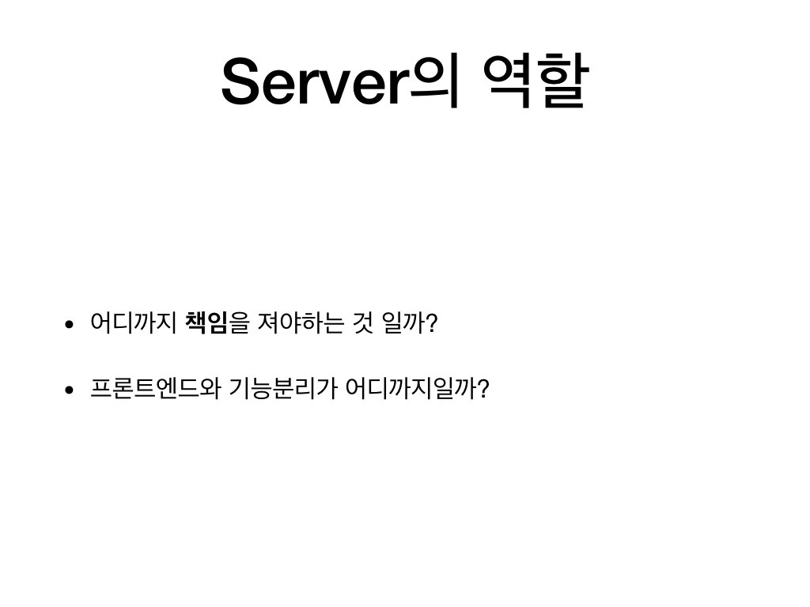
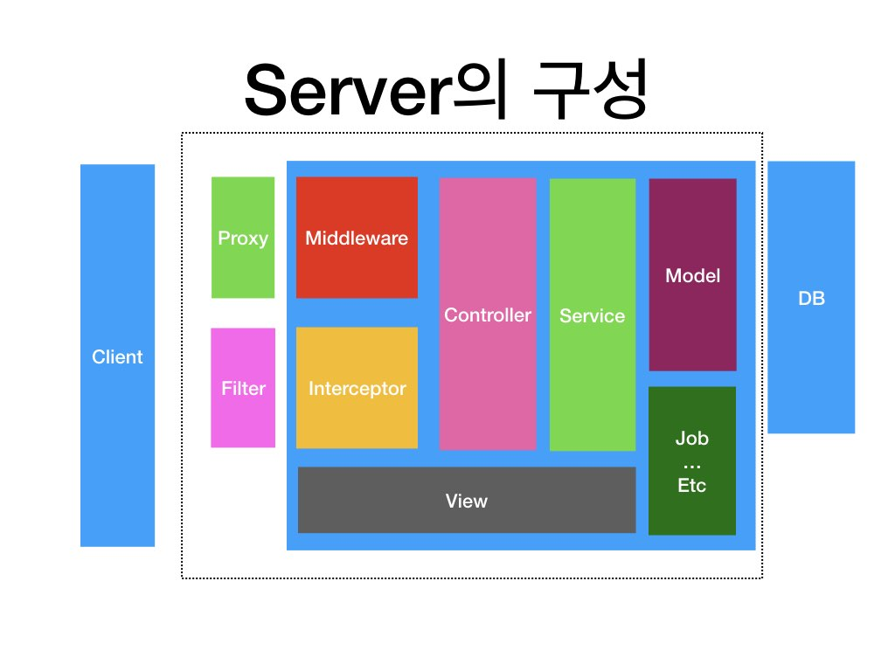
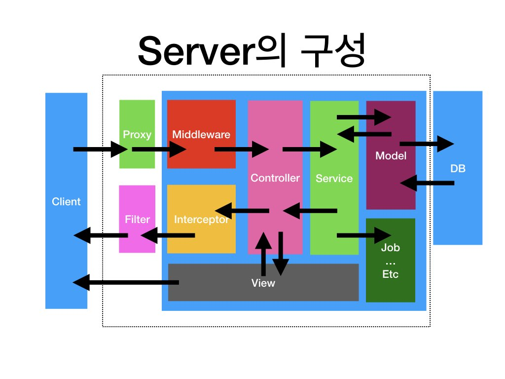

# Nodejs server study

### 스터디 진행 순서

- [x] (1주차)서버의 구조 학습
- [ ] (2주차)Restful API design, Json Response design
- [ ] (3주차)Test Driven Development(ft. jest and supertest) 
- [ ] (4주차)Deployment(Docker, AWS EB)

### 스터디 과제

- [ ] (2주차 까지) User, Book 모델을 만들고 CRUD 메서드 만들기
  - controllers, routes, service, models 사용!
- [ ] (3주차 까지) 미공개
- [ ] (4주차 까지) 미공개

### 스터디 목표

**책 대여-반납 시스템** 구현!

express 로 정돈된 코드로 작성하기!

서비스 특징
- 사용자가 있다.
- 관리자가 있다.
- 책이 있다.
- 관리자는 사용자를 차단, 승인 할 수 있다.
- 승인된 사용자는 책을 대여 할 수 있다.
- 차단된 또는 대기중인 사용자는 책을 대여할 수 없다.


##### 스터디 진행 슬라이드
아래의 구조는 MVC 패턴을 가진 서버의 구조이다. 내부 구조 중 필요한 구조를 만들어서 사용한다.
server-structure



  

##### 내부 주요 디렉토리 정리(브랜치 feature/todo 를 확인!)

파일 확인 순서
1. index.js
2. app.js
3. routes
4. middlewares
5. controllers
6. services
7. models, database

```
src
 |- controllers: 경로별로 어떤 로직을 호출해야할지 결정!
 |- database: 데이터베이스 접근 관련 코드
      |- connector.js: 데이터베이스 연결 구현
      |- repositories: models에 정의된 모델로 데이터베이스에 접근 하는 로직
 |- middlewares: 미들웨어 정의
 |- models: 데이터베이스에 접근
 |- routes: 경로-컨트롤러 대응, 경로별 미들웨어 설정
 |- services: 실제 비즈니스 로직을 구현
 |- app.js: express 어플리케이션 생성
 |- index.js: 어플리케이션 호출 로직

```
